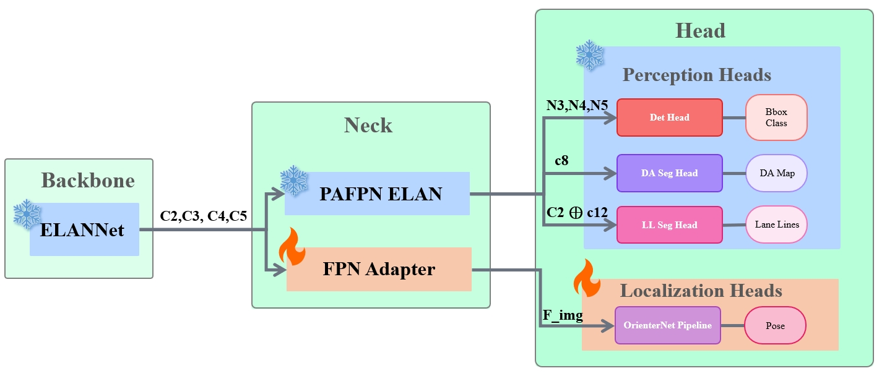
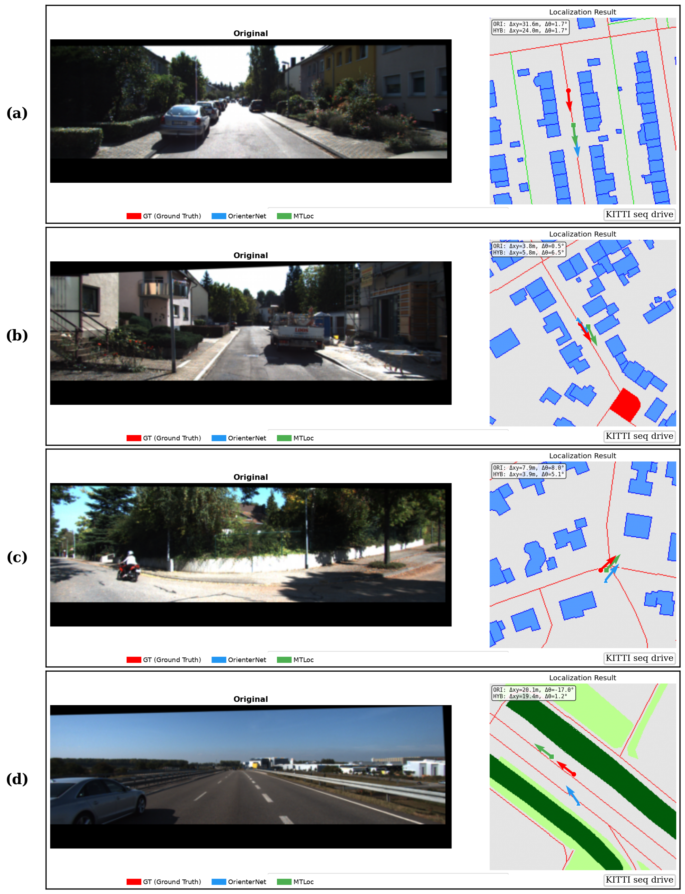

# MTLoc: Multi-Task Localization with Frozen Perception Backbone

Official implementation of **"MTLoc: Unifying Multi-Task Driving Perception and Map-Based Visual Localization via Backbone Freezing"** (IEEE Access, under review).



## Overview

MTLoc demonstrates that a frozen multi-task perception backbone (YOLOPX/ELANNet) can be repurposed for visual localization via a lightweight FPN adapter, achieving competitive localization accuracy while preserving 100% perception performance.

**Key findings:**
- A frozen YOLOPX backbone + FPN adapter (~509K params) achieves localization on par with or better than OrienterNet's dedicated ResNet-101 encoder
- Backbone freezing (`model.eval()` + `torch.no_grad()`) is both necessary and sufficient for perception-localization unification
- BatchNorm running statistics domain shift is the primary cause of catastrophic perception loss when the backbone is unfrozen


## Results

### Localization (Zero-Shot from MGL Training)

| Model | KITTI Lat@5m | KITTI Yaw@5° | nuScenes Yaw@5° | Params |
|-------|-------------|-------------|-----------------|--------|
| OrienterNet (baseline) | 88.60% | 76.23% | 54.4% | 54.94M |
| **MTLoc-445K** | **90.78%** | **77.87%** | **61.1%** | **25.68M** |

### Perception (BDD100K)

| Model | DA mIoU | LL IoU | Det mAP@50 |
|-------|---------|--------|------------|
| YOLOPX (standalone) | 0.9206 | 0.2697 | 0.8327 |
| **MTLoc (frozen)** | **0.9206** | **0.2697** | **0.8327** |

100% perception preservation with the frozen backbone strategy.

## Installation

```bash
git clone https://github.com/leolixingyou/MTLoc.git
cd MTLoc
pip install -r requirements.txt
```

## Checkpoints

Download and place in `checkpoints/`:

| File | Description | Link |
|------|-------------|------|
| `mtloc_445k.ckpt` | MTLoc best checkpoint | [Google Drive](https://drive.google.com/drive/folders/1UhLLG3vqSiYgx61SUFOjpuUqf1THN1mc?usp=drive_link) |
| `orienternet_mgl.ckpt` | OrienterNet pretrained | [Google Drive](https://drive.google.com/drive/folders/1UhLLG3vqSiYgx61SUFOjpuUqf1THN1mc?usp=drive_link) |
| `epoch-195.pth` | YOLOPX pretrained | [Google Drive](https://drive.google.com/drive/folders/1UhLLG3vqSiYgx61SUFOjpuUqf1THN1mc?usp=drive_link) |

See [checkpoints/README.md](checkpoints/README.md) for details.

## Data Preparation

See [data/README.md](data/README.md) for dataset setup instructions.

## Usage

### Evaluation

```bash
# KITTI (zero-shot localization)
python scripts/eval_kitti.py \
    --adapter_ckpt checkpoints/mtloc_445k.ckpt \
    --ckpt_path checkpoints/orienternet_mgl.ckpt \
    --yolopx_weights checkpoints/epoch-195.pth \
    --kitti_root data/kitti

# nuScenes (zero-shot localization)
python scripts/eval_nuscenes.py \
    --ckpt checkpoints/mtloc_445k.ckpt \
    --version v1.0-trainval --tiles_dir osm_tiles_trainval

# MGL (in-domain validation)
python scripts/eval_mgl.py \
    --model mtloc --adapter_type fpn \
    --adapter_ckpt checkpoints/mtloc_445k.ckpt

# BDD100K (perception preservation)
python scripts/eval_bdd100k.py --mode mtloc \
    --ckpt checkpoints/mtloc_445k.ckpt
```

### Training

```bash
# Train FPN adapter from scratch (default: 500K steps on MGL)
python scripts/train_adapter.py \
    --gpu 0 --adapter_type fpn --batch_size 4 \
    --ckpt_path checkpoints/orienternet_mgl.ckpt \
    --yolopx_weights checkpoints/epoch-195.pth \
    --data_dir data/MGL
```

## Project Structure

```
MTLoc/
├── mtloc_model.py            # Core model: MTLocNet + FPNAdapter
├── maploc/                   # OrienterNet package (decoder, data, configs)
├── lib/                      # YOLOPX package (ELANNet backbone)
├── scripts/
│   ├── train_adapter.py      # Adapter training on MGL
│   ├── eval_kitti.py         # KITTI evaluation
│   ├── eval_mgl.py           # MGL evaluation
│   ├── eval_nuscenes.py      # nuScenes evaluation
│   └── eval_bdd100k.py       # BDD100K perception evaluation
├── figures/                  # Paper figures
├── checkpoints/              # Model weights (download required)
└── data/                     # Datasets (download required)
```

## Architecture

MTLoc consists of three components:

1. **Frozen YOLOPX Backbone (ELANNet)**: Extracts multi-scale features (C2-C5) shared between perception and localization tasks. The backbone operates in `eval()` mode with `torch.no_grad()` to preserve BatchNorm statistics and perception performance.

2. **FPN Adapter (~509K params)**: Bridges the YOLOPX feature space (256-1024 dim) to OrienterNet's latent space (128 dim) using a top-down FPN architecture with L2 normalization.

3. **OrienterNet Decoder**: Performs BEV projection, OSM map encoding, and exhaustive template matching for metric localization.



## Acknowledgments

This work builds upon:
- [OrienterNet](https://github.com/facebookresearch/OrienterNet) (Sarlin et al., CVPR 2023)
- [YOLOP](https://github.com/hustvl/YOLOP) (Wu et al., 2022)

## License

This project is licensed under the MIT License - see [LICENSE](LICENSE) for details.
